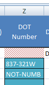

#Montpelier & Barre Crossings 2014

*All folders mentioned have their full paths on the last page

###Steps:

1. Data Entry  
  a.  Look at inspection sheet and open Excel data entry file  
  b.	Enter information from inspection sheet into columns with BLUE headers  
  c.	If multiple boxes are checked for any attribute, write **“Other”**. Indicate which boxes were checked in the **“Data Entry Notes”**  
  d.	If no boxes are checked, leave blank  
  e.	Note: Crossings are color-coded for based on whether or not the DOT number is provided. Look for the teal box pictured here 

2. Data Validation  
  a. Validate data based on questions in the orange headers  
  b. Indicate Y or N in **every** box  
3. Folder Organization  
  a. Move scanned inspection forms and images to the new folder in the **_DPR** directory  
  b. Create folders by P in the *_No DOT Number* folder  

These names model the way all subsequent files and folders should be named.

###Correct naming:
  123-456X.ips
  
###Incorrect naming *(explanation)*:  
  123456X.ips *(missing dash)*  
  123-456x.ips *(lowercase x)*  
  123 456X.ips *(space instead of dash)*  
  12-456X 2013.ips *(no year necessary)*  
  
4. DPR  
  a.	Do not upload crossings without a DOT number to DPR – store in “_No DOT Number” folder only  
  b.	Locate the blank seed file in the _DPR folder: **xxx-xxxX.ips**  
  c.  Upload inspection form with photos based on RR and MP

5. DPR Workflow
  1.	Copy the SEED file into each photo directory  
  2.	Rename the seed file to exactly match the crossing name  
  3.	Open the IPS file  
  4.	Load the images into the IPS file  
    1.	Inspection Photos  
    2.	Inspection Form  
  5.	Set the attributes (see table below)  
  6.	Apply the settings file  
  7.	Print to DPR  
  8.	Check the results in DPR for errors  
  9.	Copy the hyperlink into the <DPR Hyperlink> field  

Here are the appropriate values for the plot set attributes. You will fill in the **BOLD** ones, the rest have been set in the seed files.

|DPR Field Name       |Value                                      |
|---------------------|-------------------------------------------|
|**Town**                 |**Value from <TOWN NAME> field - ALL CAPS**    |
|**Grade Crossing Number**|**DOT Number, properly formatted**             |
|Route Number     |WACR                                   |
|**Mile Marker**          |**Value from <MP> field, properly formatted**  |
|Year Photos Taken    |Year from <InspDate> field, 4 digits       |
|**Feature Crossed**      |**Value from <Crossing Name> field - ALL CAPS**|
|**Comments**             |**(only critical notes, see examples below)**  |

Options for **Critical Notes** field:  
- No inpsection photos  
- No inspection form  
- (If you think another note should go here, please ask me first)  
 

###Data Sources:

**Excel Data-Entry File**  
  
V:\Projects\Specials\Rail_Property_Management\Inspection\Frenchy\MB_2014\Crossings\_DataEntry\MB_Crossings.xlsx  
  
**ArcMap MXD**  

V:\Projects\Specials\Rail_Property_Management\Inspection\Frenchy\MB_2014\Crossings\_DataEntry\MB_Crossings.mxd

**Photos**  
  
V:\Projects\Specials\Rail_Property_Management\Inspection\Frenchy\MB_2014\Crossings\Mile (Prefix) (MP) \ (Prefix) (MP) (Direction).jpg

**_DPR Folder with SEED files**

V:\Projects\Specials\Rail_Property_Management\Inspection\Frenchy\MB_2014\Crossings\_DPR

**Latest Track Chart**

Z:\PPID\Rail\TrackCharts\VRS Track Charts_Oct2012.pdf
